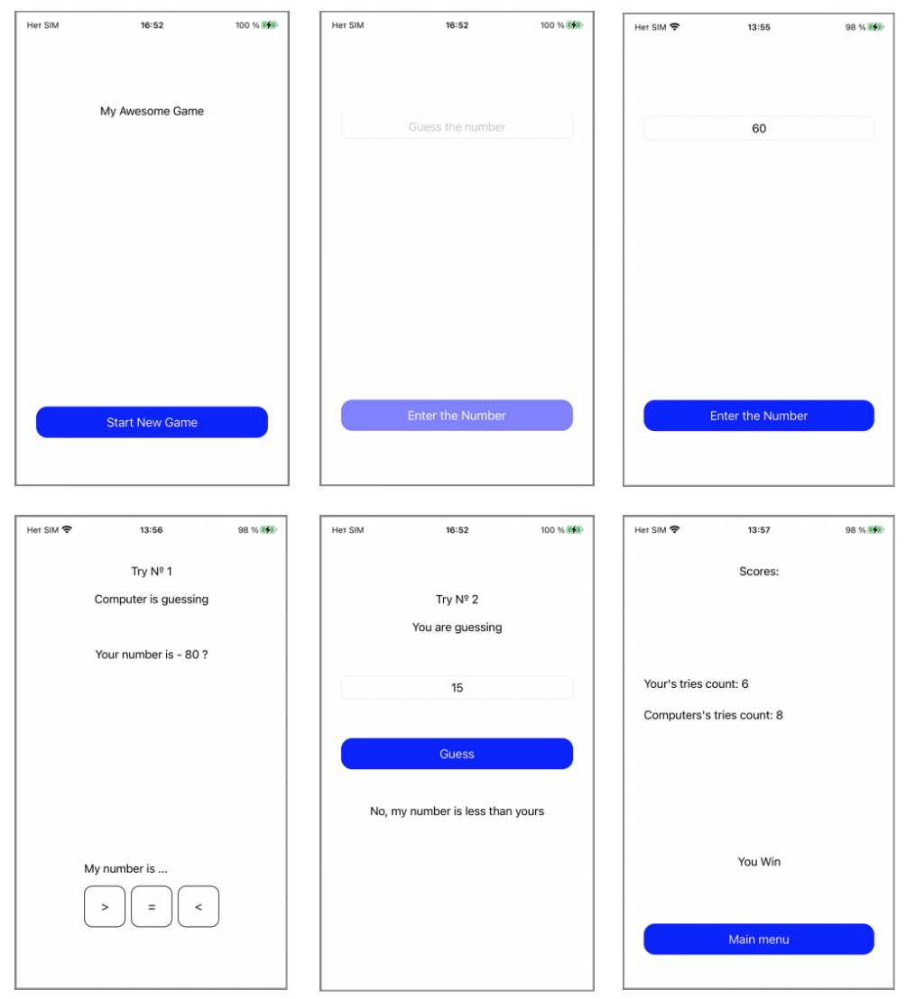

# GuessTheNumber
## Оглавление
- **[Краткое описание](#Basic)**
- **[Презентация](#Presentation)**
- **[Задание](#Task)**
- **[Будет добавлено](#ComingSoon)**

## Краткое описание
- Проект написан на **UIKit**
- Адаптивная верстка интерфейса **storyboard**. Проверна на **iPhoneSE (2st generation)**
- Приложение поддерживает как горизонтальную так и вертикальную ориентацию экрана. При автоповороте UI обновляется.
## Презентация

## Задание

- Приложение для iPhone, представляющее из себя мини игру.
- Пользователь загадывает любое целочисленное число (от 1 до 100). Отгадывающий(компьютер) должен отгадать число, ориентируясь на подсказки загадывающего.
- Загадывающий может отвечать только «больше», «меньше» или «равно».
- Раунд заканчивается когда число было угадано, в процессе ведётся подсчёт попыток.
- После отгадывания игроки меняются местами, и пользователь должен отгадать загаданное компьютером число.
- Побеждает игрок, отгадавший число соперника за наименьше количество ходов.
- Приложение должно состоять из нескольких экранов: 
• Экран старта игры
• Экран загадывания числа
• Экран отгадывания числа компьютером
• Экран отгадывания числа игроком 
• Экран с результатом игры.
Технические требования
- Для реализации интерфейса пользователя необходимо использовать стандартные элементы UIKit.
- Приложение должно поддерживать как горизонтальную так и вертикальную ориентацию экрана. При автоповороте UI должен обновляться.
- Отсутствие блокирующих багов
- Обработка некорректного поведения пользователя(например, ввод некорректных значений)
- Качество и чистота кода
- Необходимо использование одного из архитектурных подходов: MVC, MVP, MVVM, VIPER c обоснование выбора. Обоснование прикрепить в Readme проекта.